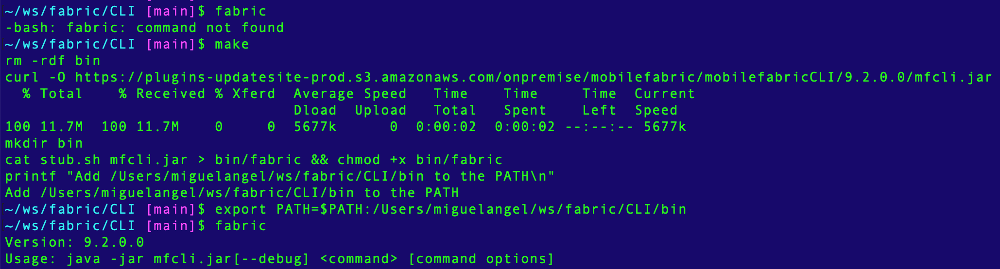

# Fabric CLI Installer

A way to download and convert the Fabric command line interface JAR `mfcli.jar` into a globally available executable command.

## How to use

Just run `make` and then add the path of the resulting binary to your `PATH` environment variable.



Now you can invoke the Fabric CLI commands from anywhere, without worrying about where the `mfcli.jar` is —e.g.:

```
fabric export --account 100000123 --user use@foo.com --password 123 --app MyApp --file MyApp.zip
```


## Credits

Based on the post found here: https://coderwall.com/p/ssuaxa/how-to-make-a-jar-file-linux-executable
